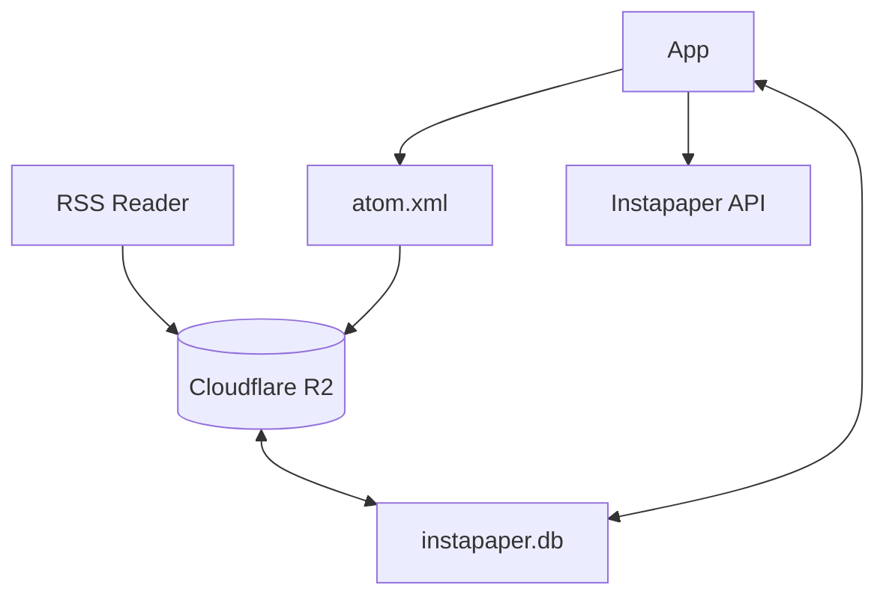

# Instapaper2RSS

A tool that converts your Instapaper bookmarks into an RSS/Atom feed, allowing you to access your Instapaper articles in any RSS reader.

_Disclaimer: This project is not affiliated with, endorsed by, or in any way officially connected to Instapaper or Cloudflare._

## Features

- OAuth authentication with Instapaper
- Incremental updates (only fetches new bookmarks)
- Persistent storage using BoltDB
- Full article content in feed entries
- Standard Atom feed format

## How It Works

The tool runs as a GitHub Action on a schedule (every 24 hours),
fetching new bookmarks from your Instapaper account and generating an Atom feed.
The feed and state are stored in Cloudflare R2 storage.



## Architecture

The project consists of several packages:

- `app`: core application logic
- `pkg/instapaper`: Instapaper API client
- `pkg/bolt`: a wrapper around BoltDB for storing state
- `pkg/atom`: Atom feed generation
- `pkg/structs`: shared data structure — Bookmark

## Setup

1. [Create an Instapaper API application](https://www.instapaper.com/main/request_oauth_consumer_token) to get your consumer key and secret
2. Set up a Cloudflare R2 bucket
3. Configure GitHub repository secrets:

   - `INSTAPAPER_CONSUMER_KEY`
   - `INSTAPAPER_CONSUMER_SECRET`
   - `INSTAPAPER_TOKEN`
   - `INSTAPAPER_TOKEN_SECRET`
   - `R2_ACCOUNT_ID`
   - `R2_ACCESS_KEY_ID`
   - `R2_ACCESS_KEY_SECRET`

## Local Development

To run locally and get your Instapaper tokens:

```bash
go run main.go -username your_username -password your_password
```

This will output your token and token secret which you can then use in the GitHub Actions secrets.

## Contributing

Contributions are welcome! Please feel free to submit a Pull Request.

## License

MIT License
